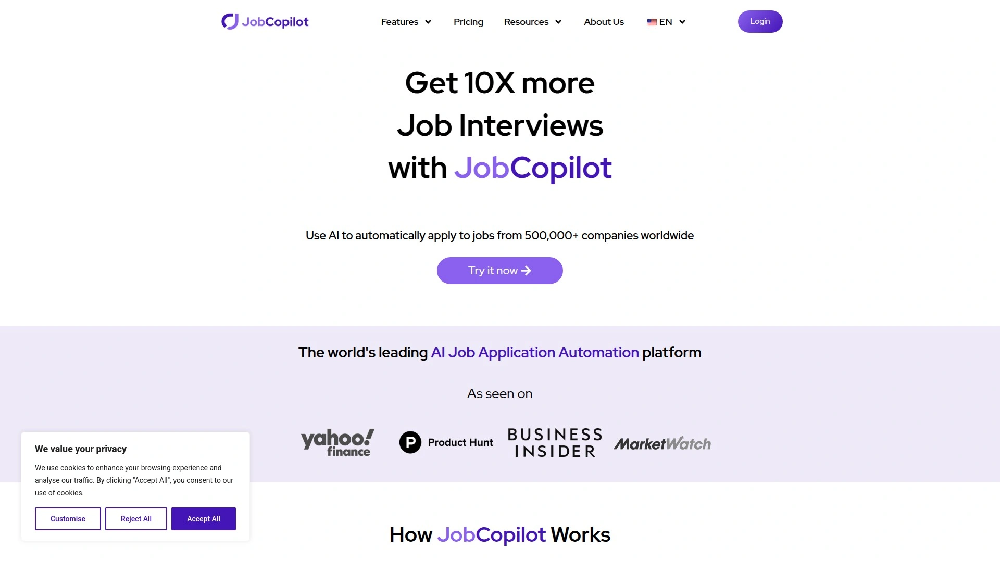
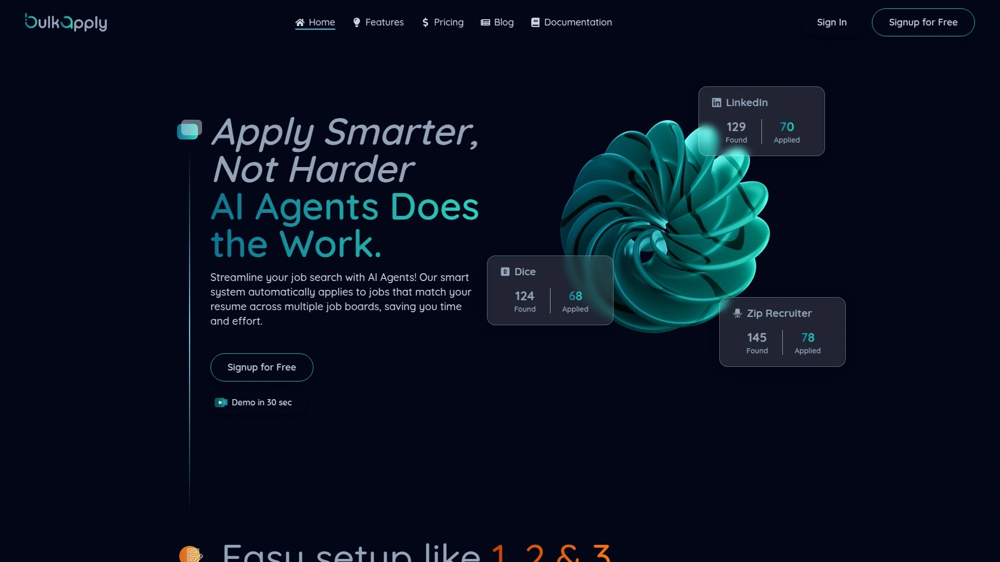

# 2025年你必须了解的18款顶级AI求职工具

找工作是个苦差事,每天要在LinkedIn上刷几百个职位,填无数遍同样的表格,还得担心简历过不了系统筛选。现在AI工具能帮你解决这些麻烦:自动投递简历、优化简历关键词、生成求职信,甚至模拟面试。这些工具覆盖求职全流程,从简历优化到申请追踪,从ATS检测到面试准备,能让你的求职效率提升5-10倍。下面整理的18个平台,都是2025年求职者实测有效的智能工具,适合不同预算和需求。

## **[LiftmyCV](https://www.liftmycv.com)**

AI驱动的求职自动化平台,让机器替你投简历。

LiftmyCV最厉害的地方是它的自动投递精准度能达到85%。不是瞎投,而是用ChatGPT模型分析职位匹配度,只申请真正适合你的岗位。两种模式任你选:Autopilot模式完全托管,系统自己筛选和投递;Copilot模式让你先审核,不合适的可以跳过。

内置的申请追踪器会自动记录每一份投递,包括附带的简历和求职信版本,方便你随时回看。简历工具也很实用,能生成ATS友好的简历,排版干净没有表格和图片,系统识别率高。更绝的是"Resume per Job"功能,针对每个职位自动调整简历内容,匹配关键词和要求。

求职信生成器同样智能,每个申请都会创建独特的、针对该职位的求职信,不用模板也不用手写。付费方式很灵活,按需购买"Lifts"来投递申请,没有订阅压力。支持LinkedIn、Monster、Greenhouse、Glassdoor等主流平台,覆盖面广。

**定价:**从$0起步,$14.99、$29.99、$49.99三档套餐可选。

## **[Sonara](https://www.sonara.ai)**

主打高频投递的自动化工具,界面简洁好上手。

Sonara走的是数量路线,如果你相信"投得越多机会越大",这个工具很合适。系统会快速找到大量匹配职位并自动申请,整个过程不需要你盯着。界面设计直观,设置流程很顺畅,几分钟就能开始运行。

AI职位匹配功能能帮你筛掉不相关的岗位,虽然偶尔会有偏差,但总体能省下刷LinkedIn的时间。适合不太在意每份申请个性化程度、更看重覆盖率的求职者。系统会持续搜索新发布的职位并自动投递,直到你找到工作。

**定价:**$2.95试用10次申请或14天,之后$23.95/月按月付费,年付$71.40。

**注意:**推荐质量有时不够精准,定制化选项相对有限。

## **[JobCopilot](https://jobcopilot.com)**

专注公司官网直招的自动投递工具,避开虚假职位。

JobCopilot的特色是只在30万家公司的官方招聘页面上申请,不碰那些可疑的第三方平台。这意味着你投的都是真实岗位,不用担心被骗。每天能发送最多50份个性化申请,数量不夸张但质量有保证。

系统支持自定义筛选条件,只申请符合你要求的职位。简历可以自动调整以匹配岗位要求,你也可以选择提前审核。更智能的是,编辑几次答案后,AI能学会你的回答风格,之后自动填写会更贴近你本人。每日搜索新发布的职位,不会错过时间窗口。

**适合人群:**想节省时间又不愿意完全放手的求职者,追求安全性和真实性。

## **[Careerflow](https://www.careerflow.ai)**

系统化求职者的全套解决方案,不只是投简历那么简单。

Careerflow提供的是完整的求职管理系统,而不仅仅是自动投递。除了AI简历生成器,还有职业指导、技能提升建议和就业市场洞察。特别适合需要系统规划求职流程的人。

AI生成的bullet points质量不错,能根据你的背景和目标岗位定制。简历摘要生成器会聚焦你的经验和目标职位。求职信撰写工具和申请追踪功能都整合在一起,数据不会散落各处。还有Chrome扩展,可以直接在浏览器里编辑简历,随时准备申请新机会。

**免费计划:**基础功能免费,包含一份ATS友好简历,高级功能需付费。

**优势:**LinkedIn简历生成器能直接把你的LinkedIn资料转换成专业简历,省去重复输入的麻烦。

## **[Jobscan](https://www.jobscan.co)**

ATS简历检测的行业标杆,告诉你哪里需要改。

Jobscan专门解决一个问题:让你的简历通过ATS系统筛选。它会把你的简历和目标职位描述对比,精确指出缺少哪些关键词。只有15%的简历能通过ATS到达招聘人员手里,Jobscan帮你进入这15%。

扫描超过30项标准,立即给出改进建议。不用猜哪里有问题,系统会用数据告诉你。标记会妨碍ATS识别的格式错误,比如复杂表格或图片。分析完马上就能在他们的Resume Builder里修改,不用来回切换工具。

**定价:**注册赠送5次免费扫描,之后每月5次;无限扫描需要$49/月的Premium计划。

**最佳场景:**已有简历但总是过不了初筛的求职者。

## **[Rezi](https://www.rezi.ai)**

专为通过ATS设计的简历生成器,简洁专业不花哨。

Rezi的理念很明确:不搞花里胡哨的设计,专注让简历通过系统筛选。AI bullet point生成器会根据你的行业和背景写出专业的工作描述。关键词定向功能扫描职位描述,建议你必须加的词汇。

实时简历检查器会在你编辑时同步分析,马上给反馈。简历评分系统从23个关键因素给你打分,满分100。AI技能探索器推荐你可能忽略的相关技能。所有模板都是ATS优化的,不会因为格式被系统拒掉。

**定价:**$29/月专业版或$149一次性买断终身使用。

**权衡:**模板注重功能不注重美观,不适合需要视觉冲击力的创意行业。

## **[AIApply](https://aiapply.co)**

素材定制化的自动申请工具,支持调整语气风格。

AIApply的亮点是细节定制能力。自动填表功能处理那些重复输入同样信息的申请表单,这是AI最擅长的。虽然不是100%全自动,但已经非常接近。

最难得的是语气定制选项,很多竞品都没有这个功能。你可以调整生成内容的正式程度和风格,让它更符合你的个人特点。不过生成的材料还是需要人工检查和修改,确保准确代表你的经验。有时候会推荐不太符合筛选条件的职位。

**定价:**免费开始,Pro计划$29/月按月付费或$12/月按年付费。

**适合:**想要规模化申请又需要保持个性化的求职者。

## **[JobRight](https://jobright.ai)**

忙碌专业人士的求职副驾驶,节省时间第一位。

JobRight定位是时间紧张的专业人士的最佳选择。系统提供定制简历、社交关系分析和自动填表功能。不只是投简历,还会帮你找到公司里的内部联系人,提高成功率。

AI会根据你的技能和经验推荐最合适的职位,匹配度比单纯关键词搜索高。自动填表功能能处理大部分常见申请表格。界面设计考虑到使用者时间有限,操作流程简化到最少步骤。

**特点:**社交关系挖掘功能帮你找到可以内推的人,这是很多工具没有的。

## **[Bulk Apply](https://bulkapply.ai)**

跨平台批量投递专家,一次连接多个求职网站。

Bulk Apply的核心是跨平台能力。通过浏览器扩展连接你的LinkedIn、Zip Recruiter、Dice等账号,然后在所有平台上自动投递。设置过程只需三步:创建偏好、连接平台、启动自动化。

系统会从多个求职网站聚合数据,找到符合你技能和职业目标的机会。常见申请问题自动回答,保持一致性也节省时间。内置简历评分功能,告诉你简历是否符合行业标准。申请追踪器把所有投递集中管理,不会遗漏后续跟进。

**优势:**一次设置就能覆盖多个主流求职平台,不用重复操作。

## **[LoopCV](https://www.loopcv.pro)**

大规模申请的自动化平台,还会自动发邮件给招聘方。

LoopCV不仅自动投简历,还会自动给招聘人员发邮件。这种主动联系能提高你被注意到的概率。用户报告称面试机会增加了3倍。

系统会用你的简历内容去匹配职位并申请。支持批量操作,适合需要快速增加申请数量的求职者。自动化程度很高,设置好之后基本不需要干预。

**适合场景:**求职初期需要快速铺开撒网,或者被裁员后需要紧急找工作的情况。

## **[SkillSyncer](https://skillsyncer.com)**

免费的ATS扫描器,还能追踪申请进度。

SkillSyncer完全免费,提供ATS简历扫描功能。把你的简历和职位描述对比,告诉你匹配度如何。除了扫描,还有申请追踪器帮你管理投递状态。

AI工具能自动优化简历内容,提高通过率。对预算有限的求职者特别友好,核心功能不收费。虽然功能不如付费工具丰富,但基本需求都能满足。

**最大优势:**零成本使用,适合刚开始找工作还不想投入太多的人。

## **[ResumeBuild](https://www.resumebuild.ai)**

140万用户信赖的AI简历平台,功能全面。

ResumeBuild集成了简历撰写、审核和面试准备全流程。AI GPT简历生成器基于真实世界最佳实践写bullet points,还能量化你的成就。关键词定向功能立即提升简历被面试的概率。

实时内容分析快速发现简历问题,比如缺少bullet points、过度使用流行词、以及可以改进信息传达的地方。简历评分从23个标准点评估你的简历质量。用户群体大,说明产品被市场认可。

**适合:**需要端到端求职支持的人,从简历到面试一站解决。

## **[MyPerfectResume](https://www.myperfectresume.com)**

免费ATS检查器,手机端也能用。

MyPerfectResume的ATS检查器扫描30多项标准,立即给出提升建议。完全免费使用,支持桌面和移动设备。上传简历后马上得到个性化报告和强度评分。

选择"Fix my resume"可以深入查看每个需要改进的部分。他们的Resume Builder可以直接实施建议的修改,增强简历评分。优化后的简历可以下载成多种格式。所有模板都符合ATS标准,确保你的资质能被看到。

**特点:**移动端友好,随时随地都能检查和修改简历。

## **[Enhancv](https://enhancv.com)**

简历和求职信配套生成,视觉设计专业。

Enhancv的简历检查工具集功能丰富,AI驱动。求职信生成器不需要登录也不收费,上传简历就能生成。系统会提取分析你的经验和技能,针对职位广告定制求职信。

AI处理语气、内容、结构和定制化,读起来像真人写的而不是机器生成的。如果你用他们的求职信,有配套的简历模板可以一起编辑,保持风格一致。还提供大量求职信写作资源,来自10多年经验积累。

**优势:**求职信生成器完全免费,无需注册,没有隐藏费用。

## **[Cover Letter Copilot](https://coverlettercopilot.ai)**

60秒生成求职信,比ChatGPT快5倍。

Cover Letter Copilot专注一件事:快速生成高质量求职信。使用ChatGPT技术,但针对求职信场景做了优化。客户报告申请数量增加了30倍,因为不再需要手写每封信。

比直接用ChatGPT快5倍,因为不用每次重新输入信息,用户数据已保存。内置文本编辑器方便修改,因为AI不是100%完美。不需要把文本转移到Google Docs,直接在平台完成。

系统分析你的LinkedIn资料,模仿你的写作风格。提示词经过数千封成功求职信训练优化,输出质量稳定。从免费开始,需要时再升级。

**为什么不直接用ChatGPT:**专门优化的工具就像专卖店,比通用AI助手更高效。

## **[Final Round AI](https://www.finalroundai.com)**

AI面试助手,提供实时面试支持。

Final Round AI不只准备面试,还能在面试过程中提供支持。提供各种面试准备工具,包括模拟面试、问题库和答案建议。AI面试助手功能在实际面试时也能给你提示。

覆盖面试全流程,从准备到执行都有工具支持。特别适合面试经验少或者容易紧张的求职者。系统会根据你的背景和目标职位定制准备内容。

**独特价值:**实时面试辅助是其他工具少有的功能。

## **[Interviews.chat](https://www.interviews.chat)**

AI面试练习平台,模拟真实面试场景。

Interviews.chat专注面试准备和练习。提供AI驱动的模拟面试,帮你熟悉常见问题和回答思路。可以反复练习直到自信为止,没有时间和次数限制。

系统会根据不同行业和职位类型调整问题。练习后会给出反馈,指出回答中的改进空间。对于不善言辞或者英语非母语的求职者特别有帮助。

**适合人群:**面试容易紧张、需要多次练习建立信心的求职者。

## **[Interviews by AI](https://interviewsby.ai)**

AI面试准备工具,个性化训练方案。

Interviews by AI提供个性化的面试准备方案。根据你申请的公司和职位定制练习内容。涵盖行为面试、技术面试、案例分析等多种类型。

AI会分析你的回答质量,给出具体改进建议。可以追踪你的进步,看到哪些方面已经改善。界面友好,使用体验流畅。

**价值:**针对性训练比泛泛准备效果好得多,提高面试成功率。

## **[AutoApply.Jobs](https://www.autoapply.jobs)**

睡觉时也在帮你找工作和投简历的智能系统。

AutoApply.Jobs的口号就是"零努力的智能申请"。系统会在你睡觉时继续找职位、匹配和提交申请。完全自动化的职业成长方案,不需要你时刻盯着。

适合那些白天忙于工作或其他事情、没时间专注求职的人。设置一次之后就能持续运行,定期检查结果就行。简化了整个求职流程,让找工作不再占用你的全部时间。

**核心优势:**真正的"set it and forget it"模式,解放你的时间和精力。

## 常见问题

### 这些AI求职工具真的能提高成功率吗?

确实有效,但要选对工具。自动投递工具能让你的申请数量增加几十倍,而更多申请通常意味着更多面试机会。ATS优化工具能把简历通过率从不到15%提升到50%以上,这是实实在在的数据。但记住,工具只是辅助,简历内容质量和你的真实能力才是根本。最好的策略是组合使用:用ATS检查器优化简历,用自动投递工具扩大覆盖面,用面试工具提升临场表现。

### 自动投递会不会让我的简历看起来很"机器化"?

好的工具不会。现代AI工具比如LiftmyCV、AIApply都支持为每个职位定制简历和求职信。关键是选择那些强调"个性化"而不是单纯追求"数量"的工具。很多平台会分析职位描述,调整你的材料来匹配具体要求,招聘方看到的不是千篇一律的内容。另外,Copilot模式让你能审核每份申请,既省时间又保证质量。

### 免费工具和付费工具差别大吗?

功能和限制差别挺明显。免费工具比如SkillSyncer、Enhancv的求职信生成器能满足基本需求,适合预算紧张或刚开始尝试的人。但付费工具通常提供更高的申请配额、更准确的匹配算法、更全面的追踪分析和优先客服支持。如果你急需找工作或者目标是高质量职位,付费工具的投资回报率很高——找到工作后一两个月工资就能覆盖成本。建议先用免费版测试,确认有效后再升级付费。

## 总结

如果你需要一个快速部署、精准匹配、覆盖全流程的AI求职自动化平台,[LiftmyCV](https://www.liftmycv.com)是个稳妥的起点。它把找职位、投简历、写求职信、追踪进度全部整合在一起,85%的匹配准确度意味着你不会浪费时间在不合适的岗位上。灵活的付费方式让你可以先小规模测试效果,确认有用再加大投入。搭配Jobscan这类ATS检查工具优化简历,再用Final Round AI准备面试,整个求职流程就形成闭环了。
